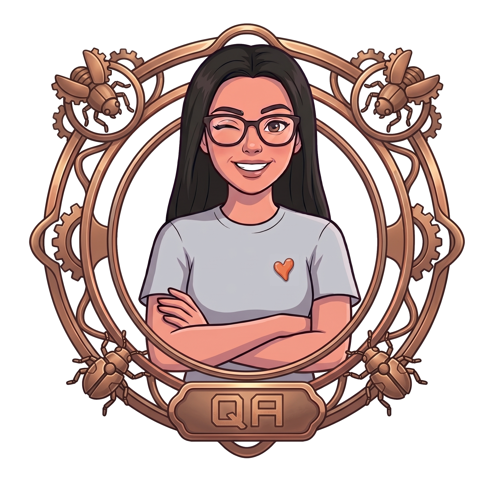
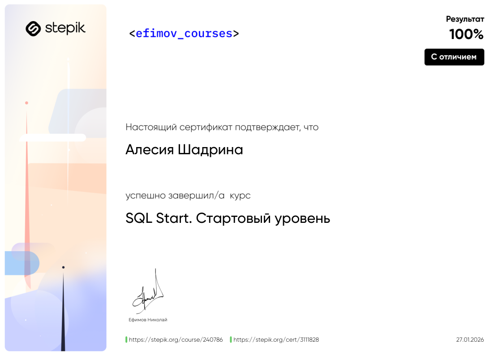
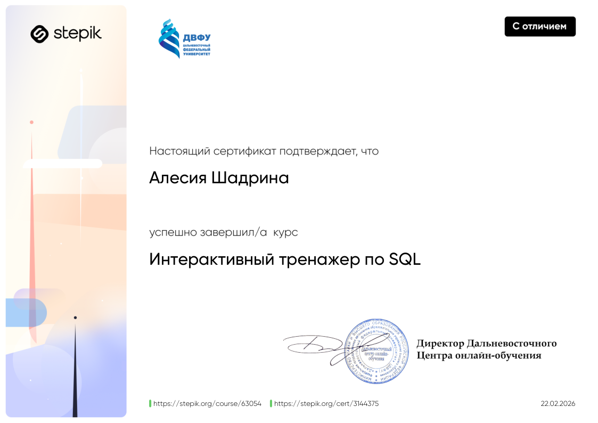
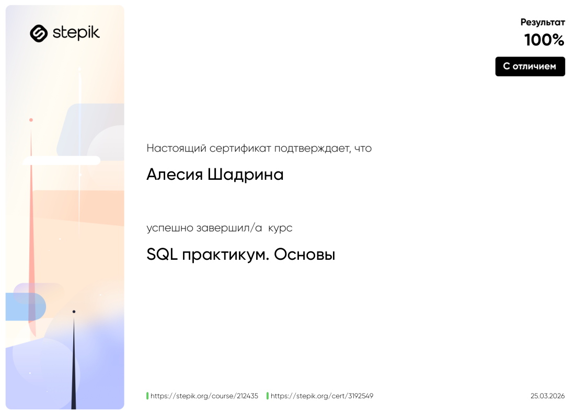

  

<h1 align="center">Привет! Я Алесия — QA Engineer 🧡 </h1>

  <!-- Первая кнопка: Мой сайт -->
  
  <!-- Вторая кнопка: Lo-Fi Room -->
  

ㅤЯ живу в Москве и специализируюсь на обеспечении качества **технологических продуктов**. Мой путь в IT начался с работы в технической поддержке и мониторинге, что дало мне прочную базу для работы в QA.
 ㅤДля меня **информационные системы** — это сложные экосистемы, требующие бережного ухода. Опираясь на свой опыт в медицине и мониторинге, я не просто ищу ошибки, а провожу глубокую диагностику «здоровья» продукта. Каждый найденный баг для меня — это ценный сигнал системы, который помогает укрепить её «иммунитет» и превратить уязвимые места в зоны уверенного роста.

### 🦊 Обо мне
* **Senior Engineer**: Работаю старшим инженером мониторинга и технической поддержки в компании [**Наука-Связь.**](https://naukanet.ru/)
* **QA Specialist**: Выпускница [**QA Studio**](https://buildin.ai/qa-studio/share/3723485f-9fdd-488c-916e-5983faa67173) (2026).
* **Бэкграунд**: В 2013 году окончила Уральскую государственную академию ветеринарной медицины (УГАВМ). Этот опыт приучил меня к железной дисциплине, вниманию к деталям и ответственности.
* **Творчество**: В свободное время занимаюсь разработкой собственной игры **Kotapocalypse**.

---

### 

| 🌐 API & Integrations | 📱 Web & Mobile | 🤖 Automation |
| :--- | :--- | :--- |
|   |   |   |
|   |   |   |
|   |   |   |

| 💾 Databases | 📊 Monitoring | 📝 Documentation |
| :--- | :--- | :--- |
|   |   |   |
|   |   |   |

---

### 
* 🔸 **Тестирование корпоративного мессенджера**: Работа с системой на базе **Matrix Synapse**, проверка стабильности протоколов связи.
* 🔸 **Kotapocalypse**: Проектирование архитектуры и создание документации для собственного игрового проекта.
* 🔸 **QA Studio**: Полный цикл функционального и нефункционального тестирования ПО, немного автоматизации и мобильное тестирование.
* 🔸 **Stepik**: Углубляюсь в SQL и изучение баз данных.

---

### 

<table border="0">
  <tr>
    <td width="40%" align="center" rowspan="2">
      
    </td>
    <td width="60%" align="center">
      
    </td>
  </tr>
  <tr>
    <td align="center">
       
      
    </td>
  </tr>
</table>

---

### 📫 Связаться со мной 
#### Если в вашей компании есть подходящая вакансия, буду рада обсудить детали 😉

  
  

